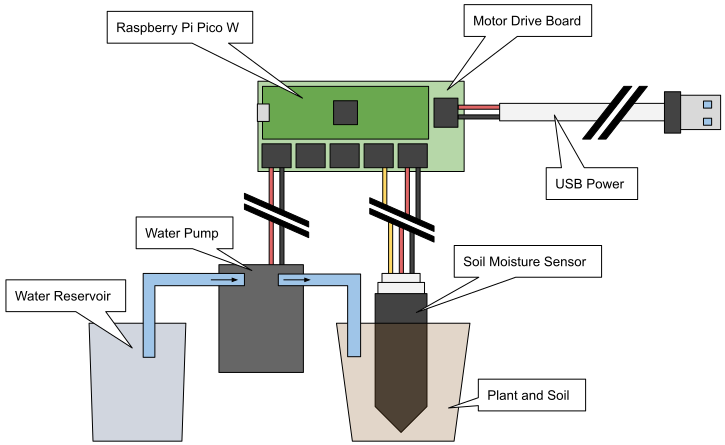

# Self-Watering Plant

## Design and Exploration

The design for this project is to use a Raspberry Pi Pico W to measure moisture
content using a capacative sensor, and if needed, deliver water to the plant
using a peristaltic pump.

